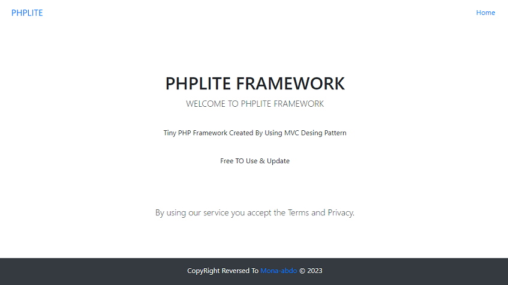

# About The Project
Simple php project framework created by using MVC design pattern

# Requirments 
<table>
<tr>
<th>PHP</th>
<th>Packages</th>
</tr>
<tr>
<td>^8.1.3</td>
<td>mona-abdo/framework: ^1.0
</td>
</tr>
</table>

# Install the Project
<pre>composer create-project --prefer-dist mona-abdo/phplite blog</pre>

